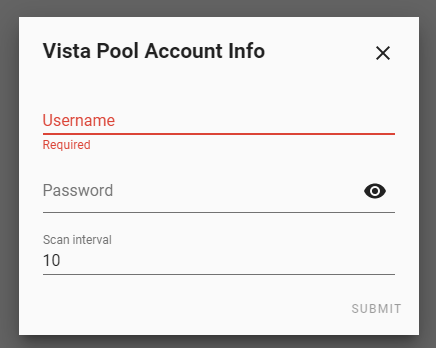

[![hacs][hacsbadge]](hacs)

Configuration
-------------

Configuration is done through the Home Assistant UI.

To add the integration, go to `Configuration->Integrations`, click `+` and search for `Vista Pool`

Configuration Variables
-----------------------
**username**

- (string)(Required)The username associated with your Vista Pool account.

**password**

- (string)(Required)The password for your given Vista Pool account.

**scan_interval**

- specify in minutes how often to fetch status data from Vista Pool (optional, default 5 min, minimum 1 min)

[hacs]: https://github.com/custom-components/hacs
[hacsbadge]: https://img.shields.io/badge/HACS-Default-orange.svg?style=for-the-badge
[license-shield]: https://img.shields.io/github/license/arjenvrh/audi_connect_ha?style=for-the-badge
